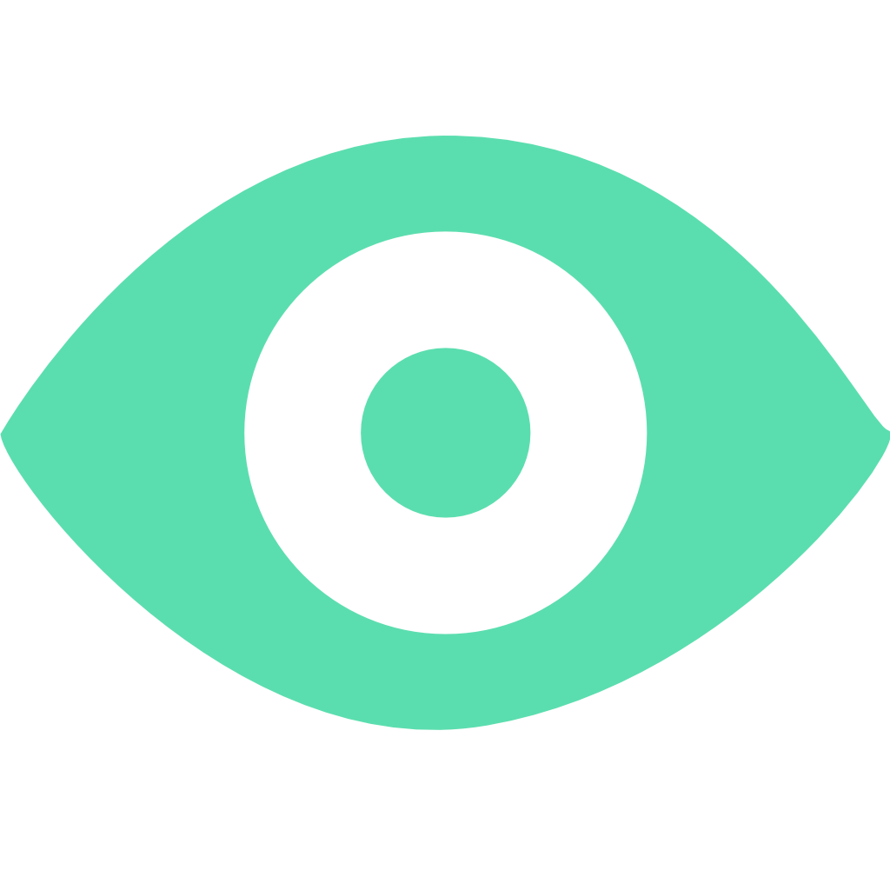
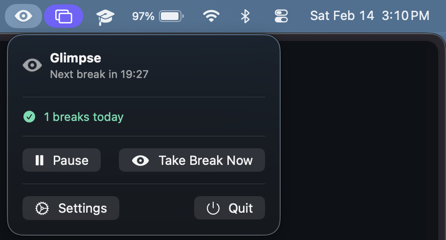
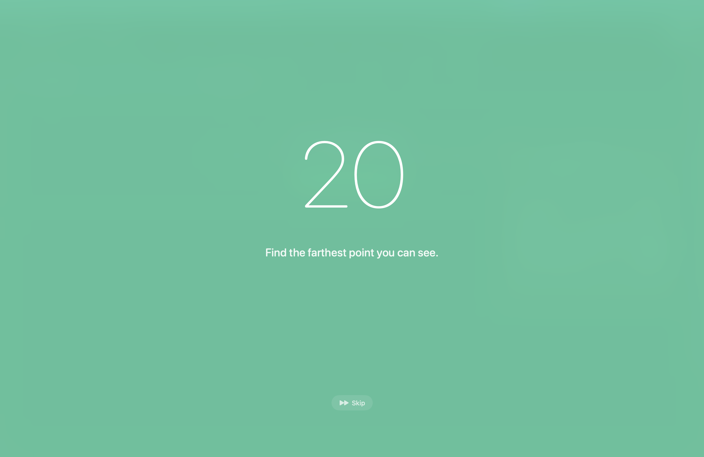
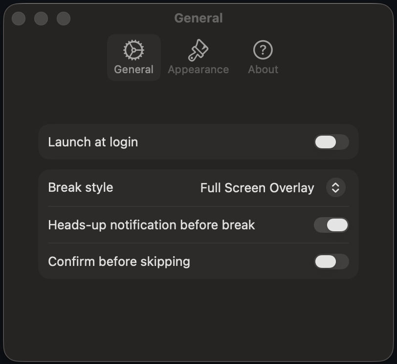

<p align="center">
  
</p>

<h1 align="center">Glimpse</h1>

<p align="center">
  A free, native macOS menu bar app for the 20-20-20 rule.<br>
  Every 20 minutes, look at something 20 feet away for 20 seconds.
</p>

<p align="center">
  
  
  
  
</p>

---

## Why I Built This

I was getting dry eyes from staring at a screen all day working on computer science projects. Every existing 20-20-20 app I found was either paid, subscription-based, Electron-wrapped, or missing basic features. I wanted to build the best, most comprehensive, and completely free macOS 20-20-20 app — one that's native, lightweight, and actually pleasant to use.

## Screenshots

<!-- Replace these with actual screenshots -->

| Menu Bar Popover | Full-Screen Overlay | Settings |
|:---:|:---:|:---:|
|  |  |  |

<!-- Optional: animated demo -->
<!--  -->

## Features

### Breaks That Actually Work
- **Full-screen overlay** with background blur and customizable color/opacity — impossible to ignore, easy on the eyes
- **Notification-only mode** if you prefer a gentler nudge
- **Automatic notification fallback** if the overlay is blocked (e.g., during full-screen games)
- **Heads-up notification** 30 seconds before each break so you can finish your thought
- **Skip button** with optional confirmation to prevent accidental dismissal
- **ESC key** to dismiss in emergencies

### Lives in Your Menu Bar
- Lightweight menu bar icon — no Dock icon, no Cmd+Tab clutter
- Live countdown to your next break
- Pause/resume anytime
- Take a break early whenever you want

### Streak Tracking
- See how many breaks you've completed today
- Consecutive skip counter to keep you honest

### Customizable
- **32 curated overlay colors** from light to dark — pick your vibe
- Adjustable overlay opacity (50%–100%)
- Choose between full-screen overlay or notification-only breaks
- Toggle heads-up notifications on/off
- Launch at login

### Quality of Life
- Handles sleep/wake gracefully — pauses when your Mac sleeps, resumes on wake
- Curated break messages with a 10% chance of getting a rare/funny one
- Optional sound chime when a break completes
- Zero external dependencies — just Apple frameworks
- Native Swift + SwiftUI — fast, small, and battery-friendly

## Installation

### Download
<!-- TODO: Add download link when distributing -->
Download the latest release from the [Releases](../../releases) page.

### Build from Source

Requires Xcode 15+ and macOS 14+.

```bash
git clone https://github.com/AmanWak/Glimpse.git
cd Glimpse
open Glimpse.xcodeproj
```

Build with Cmd+B, run with Cmd+R.

Or from the command line:

```bash
xcodebuild build -scheme Glimpse -destination 'platform=macOS'
```

## How It Works

1. Glimpse starts a 20-minute work timer
2. At 30 seconds remaining, you get a heads-up notification (if enabled)
3. When the timer hits zero, a full-screen overlay appears with a 20-second countdown
4. Look at something 20 feet away until the countdown finishes
5. The overlay dismisses automatically and the cycle repeats

That's it. Simple by design.

## Tech Stack

| | |
|---|---|
| **Language** | Swift 5.9 |
| **UI** | SwiftUI + AppKit (NSHostingView for overlays) |
| **Frameworks** | SwiftUI, AppKit, UserNotifications, ServiceManagement |
| **Architecture** | Coordinator pattern with callback-based managers |
| **Testing** | Swift Testing framework |
| **Dependencies** | None |

## License

MIT

---

<p align="center">
  Built with dry eyes and good intentions.
</p>
