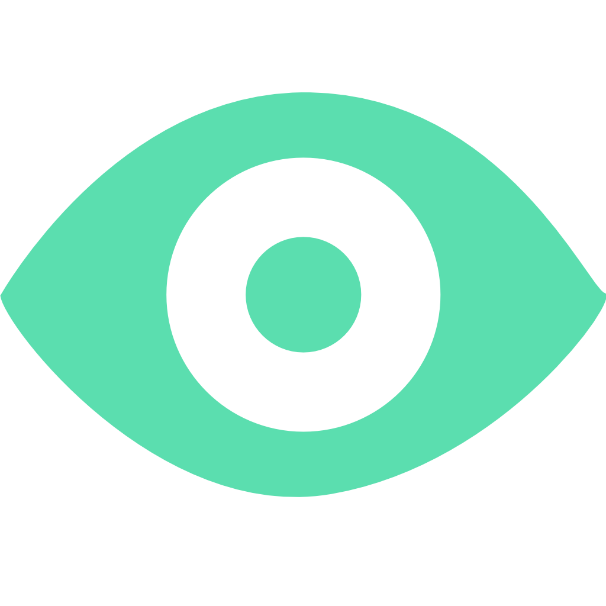
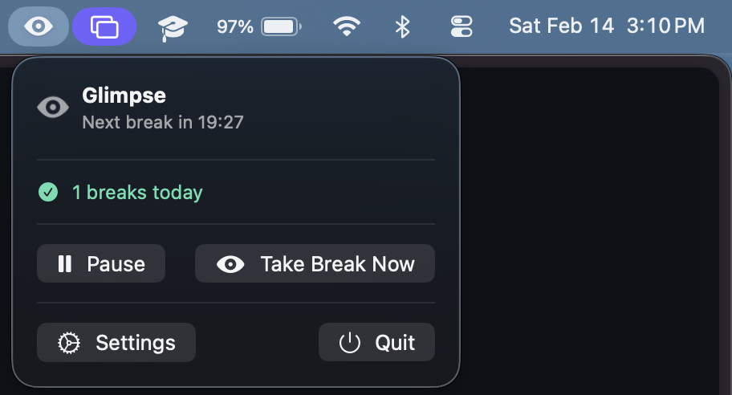
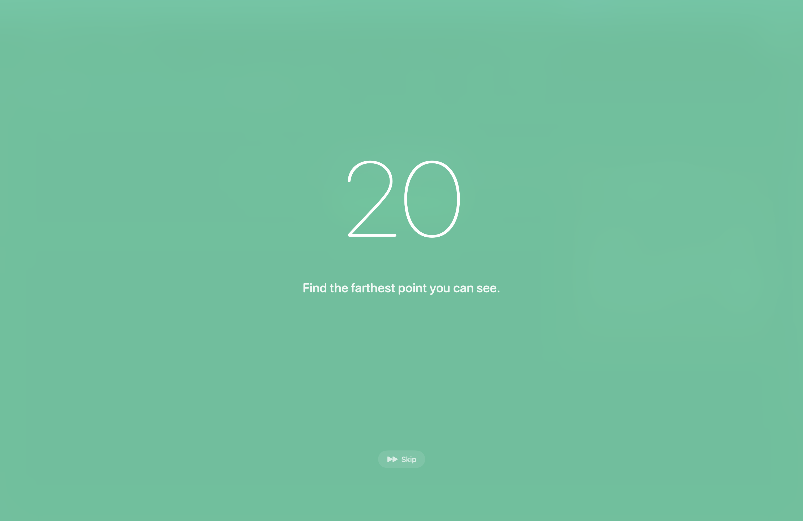
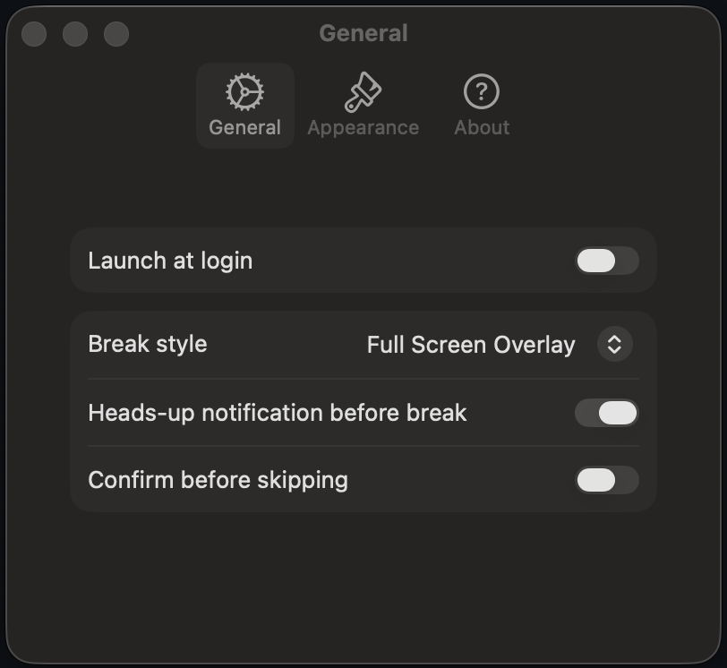

<p align="center">
  
</p>

<h1 align="center">Glimpse</h1>

<p align="center">
  A small macOS menu bar app that reminds you to rest your eyes.<br>
  Every 20 minutes, look at something 20 feet away for 20 seconds.
</p>

<p align="center">
  <a href="https://github.com/AmanWak/Glimpse/releases/latest"></a>
  <a href="https://github.com/AmanWak/Glimpse/actions/workflows/ci.yml"></a>
  
  <a href="LICENSE"></a>
</p>

| Menu bar | Full-screen break | Settings |
|:---:|:---:|:---:|
|  |  |  |

## Why I built this

<!-- Rewrite this section in your own words before merging. A few honest sentences
     about why you made it beat anything polished. -->

I was getting dry eyes from staring at a screen all day while working on computer
science projects.

## What it does

Glimpse sits in the menu bar and counts down your work interval. When it's time for a
break, it shows one in the style you picked:

- a pill that drops out of the MacBook notch (top center on Macs without one)
- a full-screen blur with a countdown
- a small banner that follows your cursor
- a plain notification

It tries not to interrupt at a bad moment. If you're typing, the break waits for a pause
(up to a minute). It also holds off while a game is in front, while a game controller is
connected, or while an app on your watch list is open, like Zoom or Steam. After a long
sleep it resets the timer instead of firing a stale break.

Other things you can set: work interval (5 to 60 minutes), break length (10 to 120
seconds), overlay color and opacity, a heads-up notification 30 seconds before a break,
your own notes to show during breaks, a menu bar countdown, launch at login, and a sound
when the break ends. You can snooze for 1 to 4 hours from the menu bar, and the popover
shows how many breaks you finished today and over the last 7 days.

## Install

Download the latest build from the [Releases page](https://github.com/AmanWak/Glimpse/releases/latest),
unzip it, and move Glimpse.app to Applications.

Glimpse isn't notarized yet, so macOS will block it the first time. Open it once, then go
to System Settings > Privacy & Security, scroll down, and click Open Anyway.

The current release (v1.2) is older than notch mode, waiting while you type, game and
app pausing, snooze, and the 7-day history. Those are on `main` and will be in the next
release. To try them now, build from source.

## Build from source

You need Xcode 26 or later.

```bash
git clone https://github.com/AmanWak/Glimpse.git
cd Glimpse
open Glimpse.xcodeproj
```

Then build and run with ⌘R. From the command line:

```bash
xcodebuild build -scheme Glimpse -destination 'platform=macOS'
```

## Privacy

Glimpse doesn't make network requests or collect anything. Settings and break history
stay in `UserDefaults` on your Mac. To tell whether you're typing, it asks macOS how long
it's been since the last keypress (`CGEventSource`). It never sees which keys you press,
so it doesn't need Accessibility or Input Monitoring permission.

## Known limitations

- Meetings in a browser, like Google Meet, aren't detected yet.
- It requires macOS 26.1, though most of what it uses exists on older versions.
- No sync, no accounts, no App Store version.

## How it's built

Swift, SwiftUI, and AppKit, with no third-party dependencies. The break windows are
AppKit windows hosting SwiftUI views. There are 127 unit tests using Swift Testing, and
CI builds and tests every push.

## Contributing

Bug reports and ideas are welcome. Please [open an issue](https://github.com/AmanWak/Glimpse/issues/new/choose),
and read [CONTRIBUTING.md](CONTRIBUTING.md) before sending a pull request.

## License

[MIT](LICENSE)
